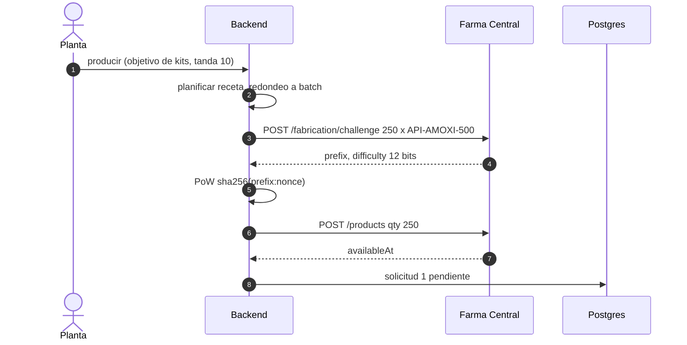
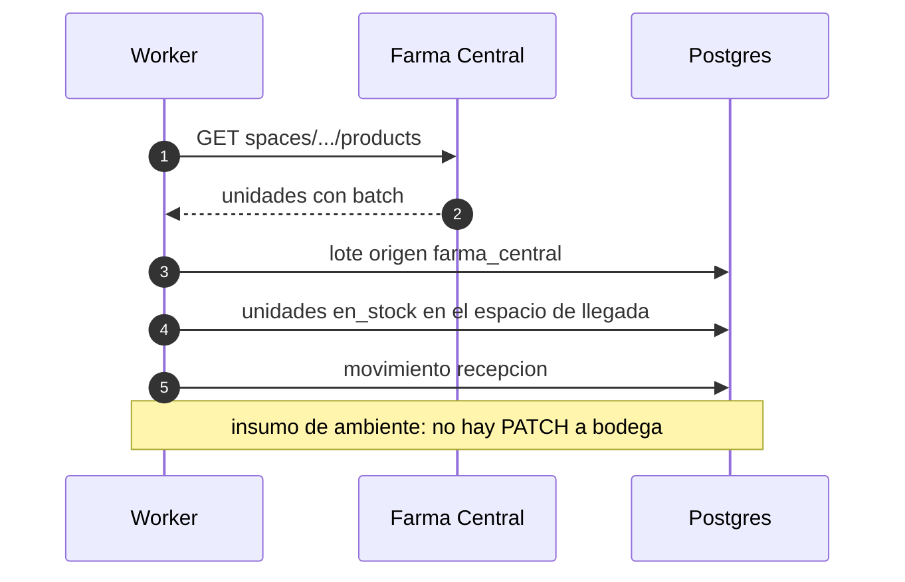
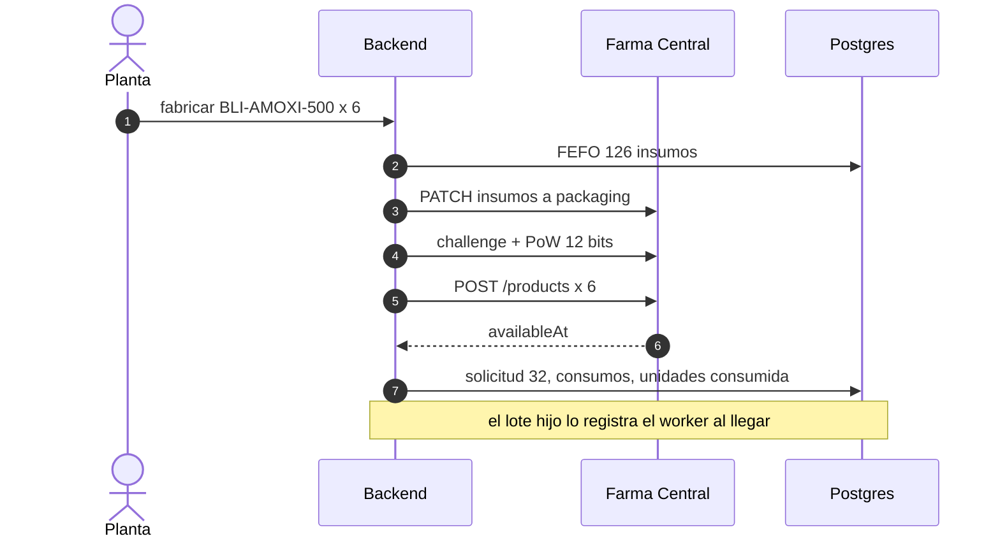
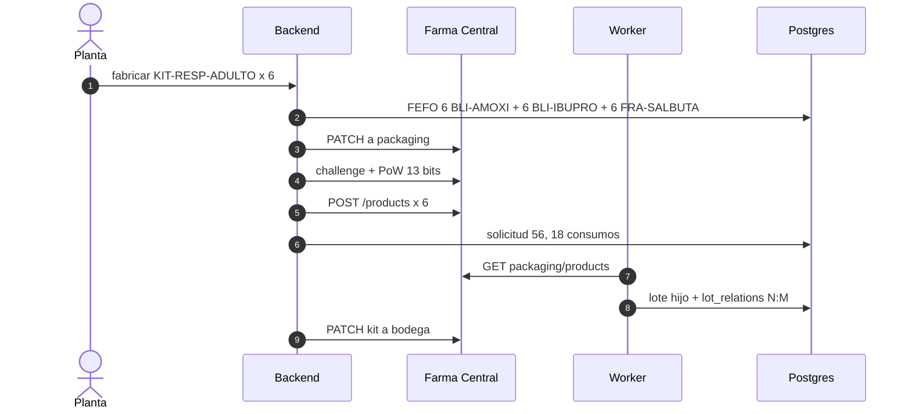
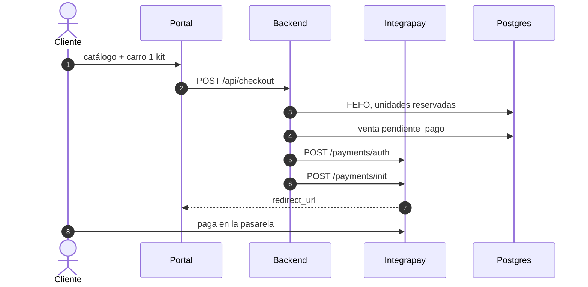
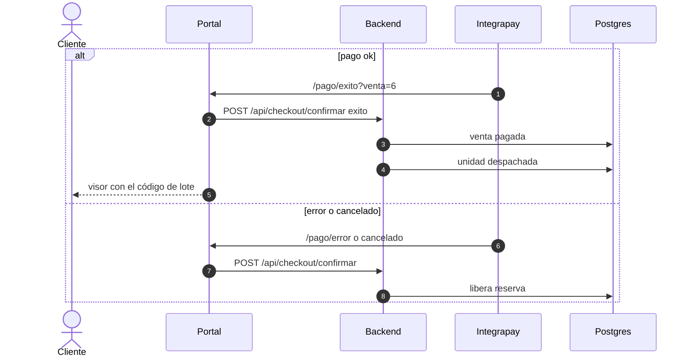
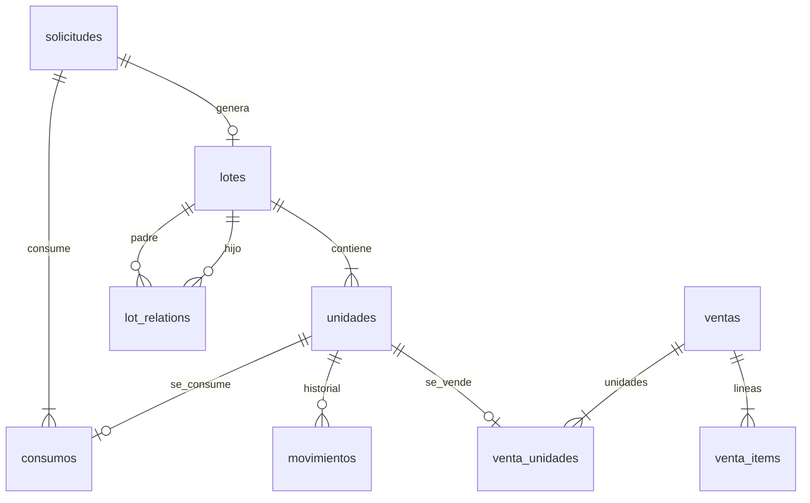

# Diagramas de secuencia — Entrega 1

Instancias de PROD (6–7 oct 2026): compra **#1** 250 × `API-AMOXI-500`; fabricación **#32** 6 × `BLI-AMOXI-500`; fabricación **#56** 6 × `KIT-RESP-ADULTO`; venta **#6** lote `L-KIT-RESP-ADULTO-261006-60e8`.

Los tres flujos que pide el enunciado no son genéricos. El código que los ejecuta es `producir` / `comprar` / `fabricar`, el worker (`worker/main.py`) y `iniciar_checkout`.

PNG para Word: [`docs/img/`](img/).

---

## Abastecimiento — pedir `API-AMOXI-500`

`producir` arma una tanda, `planificar` calcula el faltante y `comprar` pide el desafío, resuelve el PoW y deja una solicitud pendiente. Farma responde `availableAt`; el lote todavía no existe en nuestra base.

---

## Abastecimiento — recepción

El worker, cada 20 s, registra las unidades nuevas donde Farma las dejó. `API-AMOXI-500` no es frío: **no** se mueve a bodega. Queda usable en checkIn (o en buffer si Farma no cupo en recepción). Solo lo frío va a cámara, o a buffer si la cámara está llena.

---

## Acondicionamiento — fabricar `BLI-AMOXI-500`

Lote de 6 (PROD #32). Consume 72 API + 48 EXC + 6 LAM. `fabricar` elige FEFO, mueve a packaging, PoW y POST. El lote hijo lo registra el worker cuando aparece, no en este request.

---

## Acondicionamiento — armar `KIT-RESP-ADULTO`

Lote de 6 (PROD #56). Consume 18 acondicionados (6+6+6). `lot_relations` se escribe cuando el worker ve el kit nacido, no en el POST de fabricación. El kit de ambiente lo saca `producir` (`_despejar`) de packaging a bodega en una vuelta siguiente.

---

## Venta — reserva FEFO e Integrapay

Pedido #6. 1 × `KIT-RESP-ADULTO`, lote `L-KIT-RESP-ADULTO-261006-60e8`. La reserva es **antes** de `POST /payments/init`. Si Integrapay no arranca, se libera.

---

## Venta — resultado y despacho

`DISPATCH_FARMA=0`: se confirma el despacho en custodia **sin** mover la unidad a checkOut en Farma.

---

## Modelo de datos (custodia)

Tablas en `app/models.py`. Relación consumido↔generado: `lot_relations` (N:M), al nacer el lote hijo.

