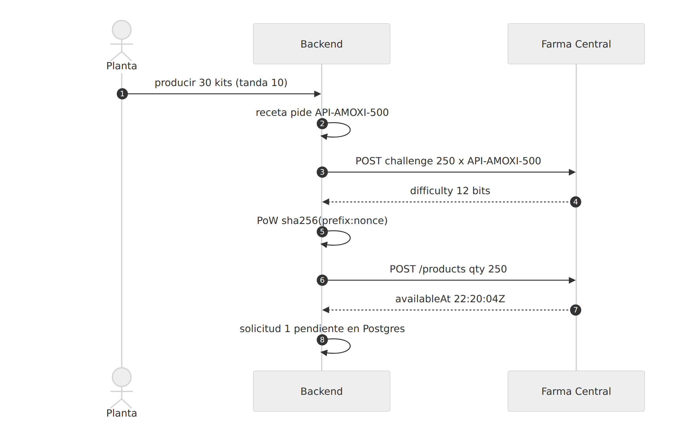
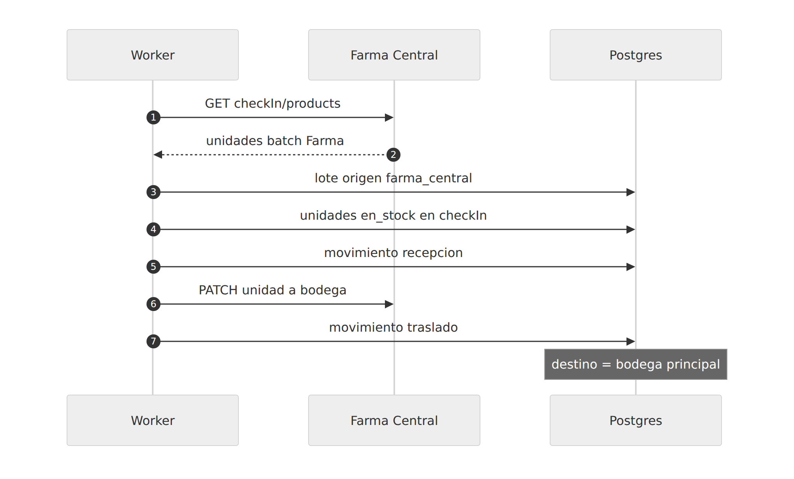
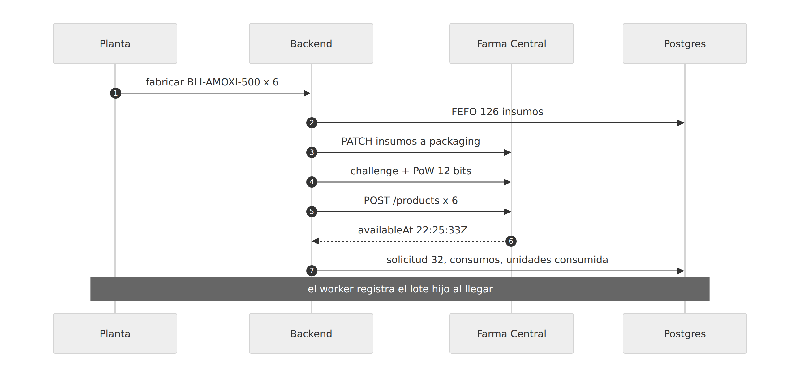
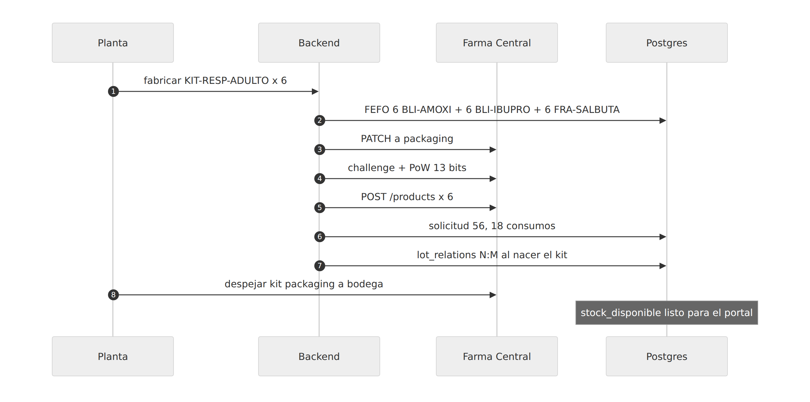
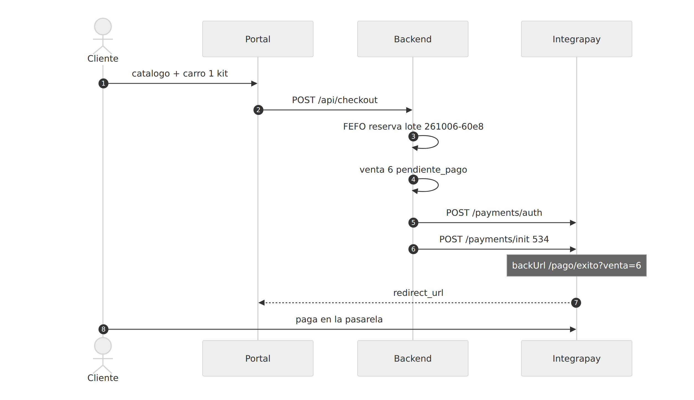
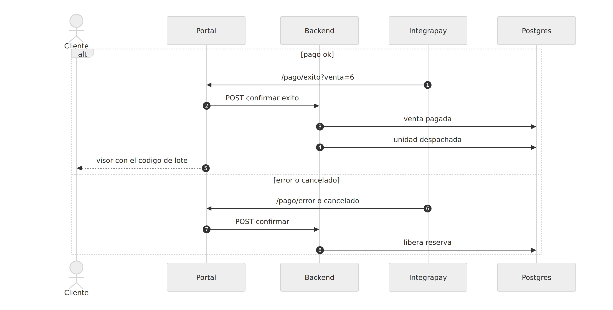
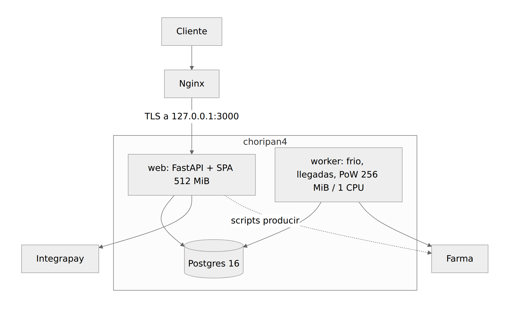
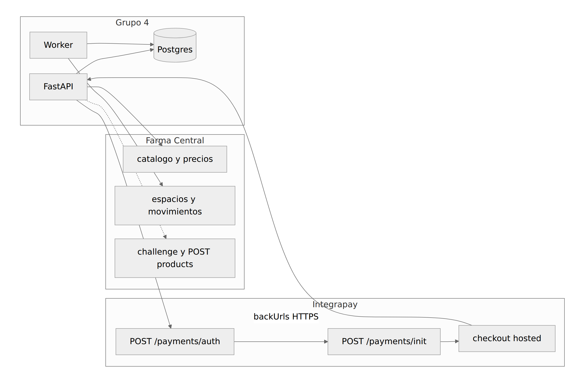
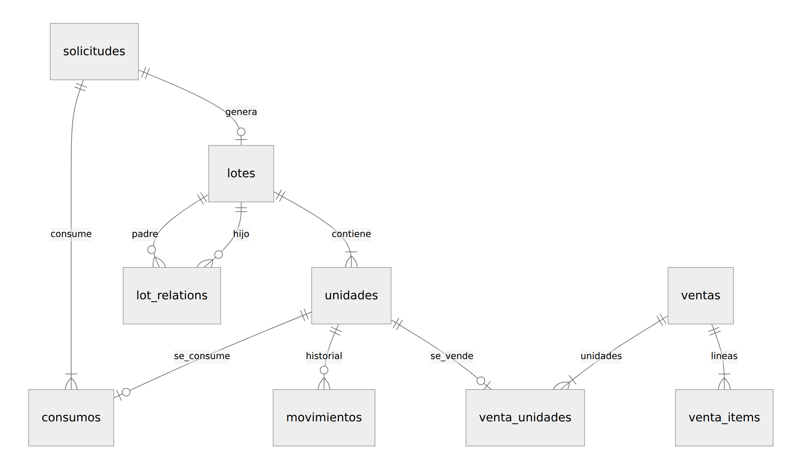

# A. Diagramas de secuencia (e integración)

Los tres flujos del PDF están **instanciados** sobre `KIT-RESP-ADULTO` y su cadena de amoxicilina. Fuente visual (Mermaid a tamaño real, se lee mejor en GitHub/Cursor): **[diagramas.md](diagramas.md)**. Aquí va la prosa y, para el PDF, las mismas figuras exportadas a PNG.

Cadenas del repo: `comprar` → `_pedir_con_pow` → `request_products` → `registrar_compra`; `fabricar` → `registrar_fabricacion`; `iniciar_checkout` → `crear_transaccion` → `finalizar`.

---

## 1. Abastecimiento de `API-AMOXI-500`

**Instancia PROD (6 oct 2026, `logs.txt`):** `producir` arma 30 kits de cada tipo. Primera compra: **solicitud #1, 250 × `API-AMOXI-500`**. PoW 12 bits. Farma responde `availableAt` 22:20:04Z (~31 s). El lote nace en `checkIn` y el worker lo deja en **bodega** (el API no es frío). 250 es múltiplo del `production.batch` de esa noche.

Código: `app/operaciones.py` (`comprar`, `_pedir_con_pow`), `app/pow.py`, `app/farma_client.py`, `app/custodia.py` (`registrar_compra`, `registrar_llegadas`), `worker/main.py`.

---

## 2. Acondicionamiento: `BLI-AMOXI-500` y armado de `KIT-RESP-ADULTO`

El PDF pide **los dos tramos**. Receta del enunciado (§4 y §8.2):

| Componente | Por 1 × BLI | Lote de 3 | Lote de 6 (PROD #32) |
|---|---|---|---|
| `API-AMOXI-500` | 12 | 36 | 72 |
| `EXC-LACTOSA-DC` | 8 | 24 | 48 |
| `LAM-BLISTER-PVC` | 1 | 3 | 6 |
| **Unidades consumidas** | 21 | 63 | **126** |

**Tramo 1:** fabricación **#32**, 6 × `BLI-AMOXI-500`, 126 insumos, PoW 12 bits. FEFO → `packaging` → challenge → consumo. El worker registra la **generación** del lote hijo.

**Tramo 2:** fabricación **#56**, 6 × `KIT-RESP-ADULTO`, **18** acondicionados (6+6+6). PoW 13 bits. El kit ambiente se despeja a bodega.

`fabricar` no espera el `availableAt`. Si Farma acepta el POST y Postgres falla, queda un `CRITICAL` con los `_id` (no hay transacción distribuida).

---

## 3. Venta de `KIT-RESP-ADULTO`

**Instancia PROD:** pedido **#6**, `pagada`, 1 kit, lote FEFO `L-KIT-RESP-ADULTO-261006-60e8`, $534. Integrapay real (~20 % de error en E1). `DISPATCH_FARMA=0`: despacho solo en custodia, sin `PATCH` a `checkOut`.

Código: `web/src/pages/Checkout.tsx`, `app/ventas.py`, `app/integrations/checkout.py`, `app/main.py`.

---

## 4. Anexo — Arquitectura de procesos

No lo exige el PDF como diagrama nombrado. Partición en el servidor de 2 GB.

| Unidad | Qué hace | Límite |
|---|---|---|
| `web` | Uvicorn, SPA `web/dist`, APIs | 512 MiB, 2 workers |
| `worker` | Llegadas, frío, `recuperar_pendientes`; PoW en worker o `compose run` | 256 MiB, **1.0 CPU** |
| `db` | Custodia | 512 MiB, puerto `127.0.0.1:5433` |

Nginx termina TLS hacia `127.0.0.1:3000`. **Nunca** `docker compose down -v`.

---

## 5. Anexo — Integración con sistemas del curso

| Contraparte | Contrato | Uso en E1 |
|---|---|---|
| Farma Central | `farma_client.request` (token, 401, 429) | Catálogo, precios, espacios, PoW, compras, fabricaciones, movimientos |
| Integrapay | `POST /payments/auth` + `POST /payments/init` y `backUrls` | Host prod **sin** sufijo `/checkout` |
| Visor | No llama a Farma | Postgres, UI en `/trazabilidad?lote=` |

---

## 6. Anexo — Modelo de datos (ER)

Tablas en [`app/models.py`](../../app/models.py). Nombres en español.

Relación consumido↔generado **N:M**, materializada en `lot_relations` al nacer el hijo.
