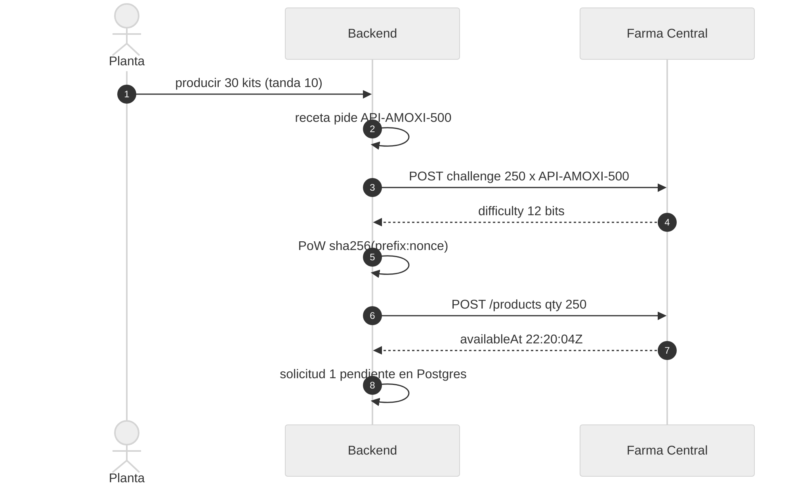
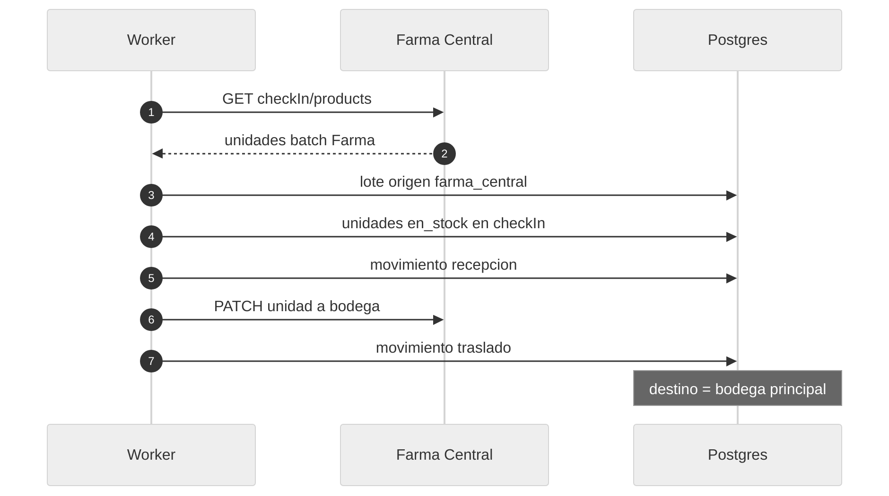
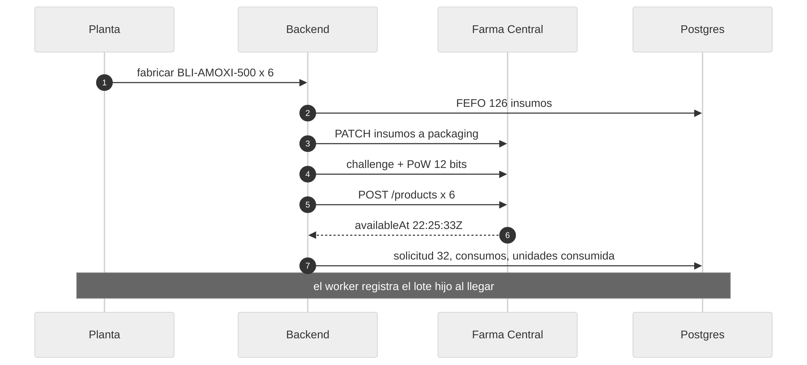
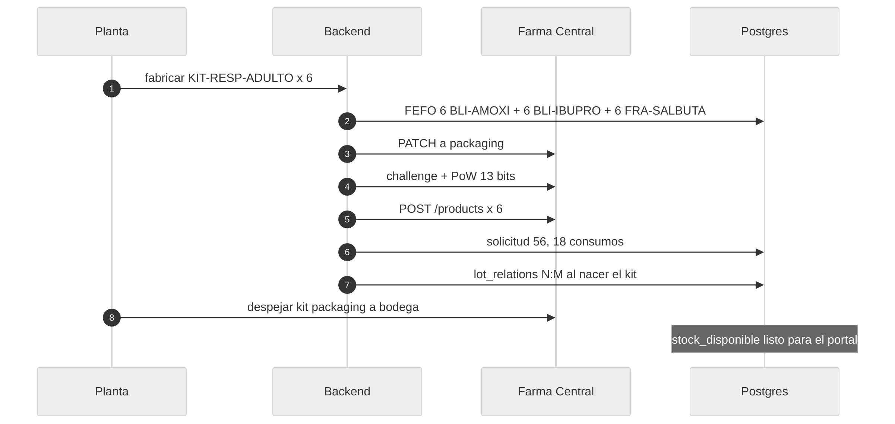
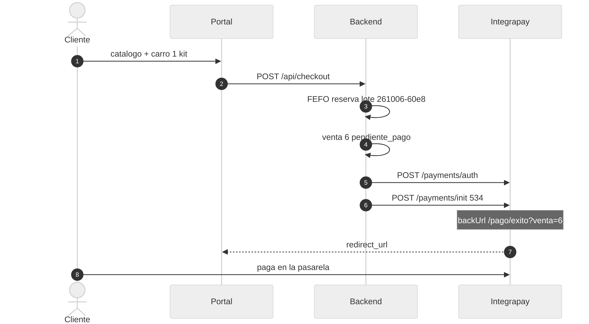
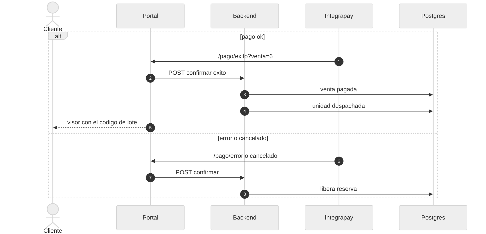
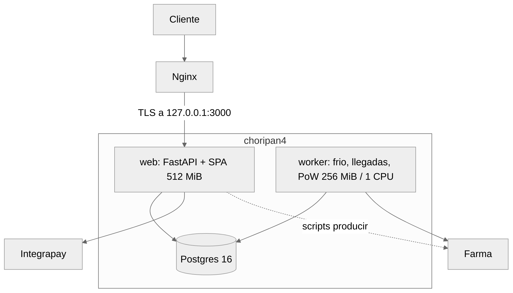
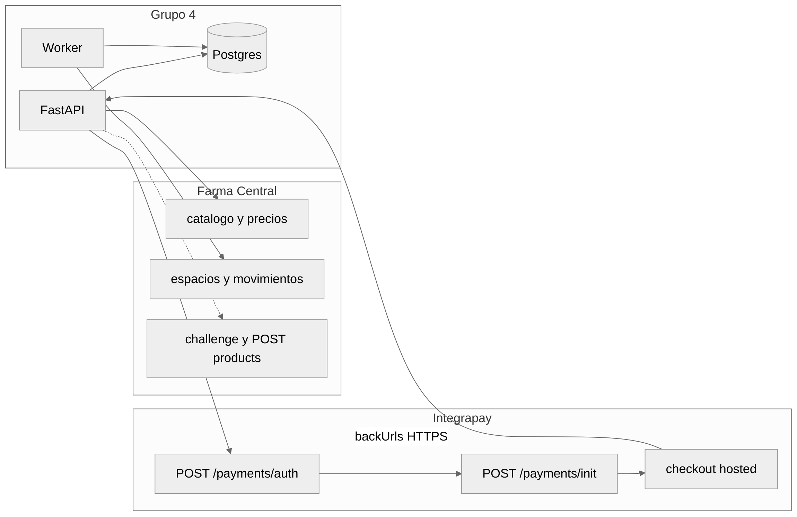
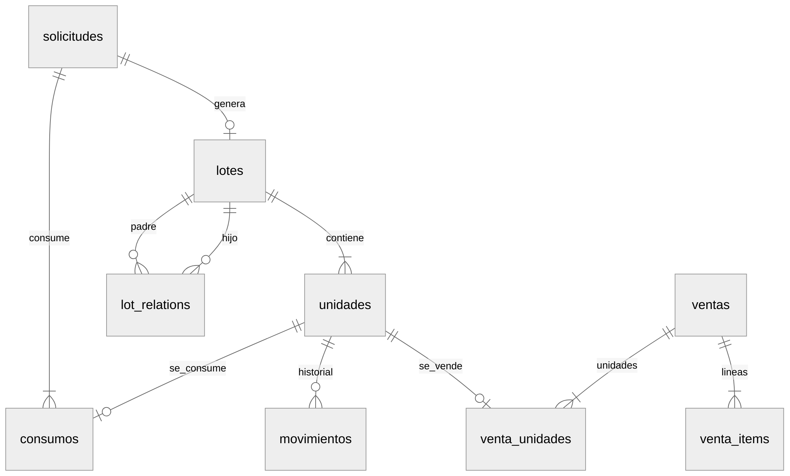

# Diagramas Entrega 1 — Distribuidora 4

Vista grande de los diagramas del informe. En GitHub o en el preview de Cursor se leen mejor que en el PDF (ahí van como imágenes).

Instancias PROD (`logs.txt`, 6–7 oct 2026): compra **#1** 250 × `API-AMOXI-500`; fabricación **#32** 6 × `BLI-AMOXI-500`; fabricación **#56** 6 × `KIT-RESP-ADULTO`; venta **#6** lote `L-KIT-RESP-ADULTO-261006-60e8`.

Prosa y tablas: [01-diagramas.md](01-diagramas.md). PDF: [Informe_Entrega1_Distribuidora4.pdf](Informe_Entrega1_Distribuidora4.pdf).

---

## A1. Abastecimiento — pedir el insumo

Solicitud #1. Destino posterior: bodega (el API no es frío).

---

## A2. Abastecimiento — recepción y bodega

Worker cada 20 s. Almacenamiento: **checkIn → bodega**.

---

## A3. Acondicionamiento — fabricar `BLI-AMOXI-500`

Lote de 6 (PROD #32). Consume 72 API + 48 EXC + 6 LAM = 126 unidades.

---

## A4. Acondicionamiento — armar `KIT-RESP-ADULTO`

Lote de 6 (PROD #56). Consume 18 acondicionados (6+6+6). Kit ambiente → bodega.

---

## A5. Venta — reserva FEFO e Integrapay

Pedido #6. 1 × `KIT-RESP-ADULTO`, $534, lote `L-KIT-RESP-ADULTO-261006-60e8`.

---

## A6. Venta — resultado y despacho

`DISPATCH_FARMA=0`: custodia confirma el despacho **sin** mover en Farma. ~20 % de error en E1.

---

## B. Arquitectura de procesos

Servidor 2 GB. Un HTTP, un worker, Postgres. Node no corre en PROD.

---

## C. Integración Farma e Integrapay

El visor **no** llama a Farma: `GET /api/trazabilidad/{codigo}` lee solo Postgres. La UI pública es `/trazabilidad?lote=`.

---

## D. Modelo de datos (custodia)

Campos en `app/models.py`. Aquí solo las relaciones. Historial = `movimientos` + `consumos` + `lot_relations` (no hay tabla `custody_events`).

N:M: un blíster tiene tres padres de insumo; un kit tiene tres padres acondicionados. Se materializa en `lot_relations` al nacer el hijo.